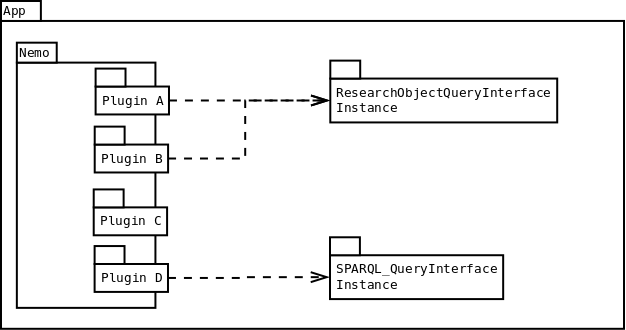
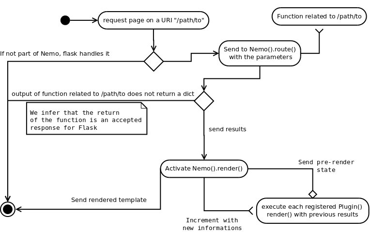

Workflow Nemo Design
====================

Application Hierarchy
#####################

Some information is inherited from: [Nemo.workflow.rst](https://github.com/Capitains/flask-capitains-nemo/blob/dev/docs/Nemo.workflow.rst).

.. _ApplicationHierarchy:

This workflow demonstrates how components works together

Nemo Rendering Workflow
#######################

.. _RenderWorkflow:

@TODO: Add [Varnish](https://varnish-cache.org/docs/7.6/tutorial/introduction.html#)

